<div align="center">


# NekoBot Android

**和你的 AI 伙伴，开始一场温柔的对话**

原生 Android 客户端 · 服务器 / 本地双模式 · 深色玻璃拟态 UI

[](https://github.com/asukaneko/Nekobot-Android/releases/latest)
[](https://github.com/asukaneko/Nekobot-Android/releases)
[](https://developer.android.com)
[](https://kotlinlang.org)
[](LICENSE)
[](https://github.com/asukaneko/Nekobot-Android/stargazers)

[应用截图](#-应用截图) · [功能特性](#-功能特性) · [Agent 模式](#-agent-模式) · [下载安装](#-下载安装) · [双模式](#-双模式架构) · [从源码构建](#-从源码构建) · [更新日志](changelog.md) · [官方网站](https://asukaneko.github.io/Nekobot-Android/)

**中文** | [English](./README_EN.md)

</div>

---

## 📱 应用截图

<table>
  <tr>
    <td align="center">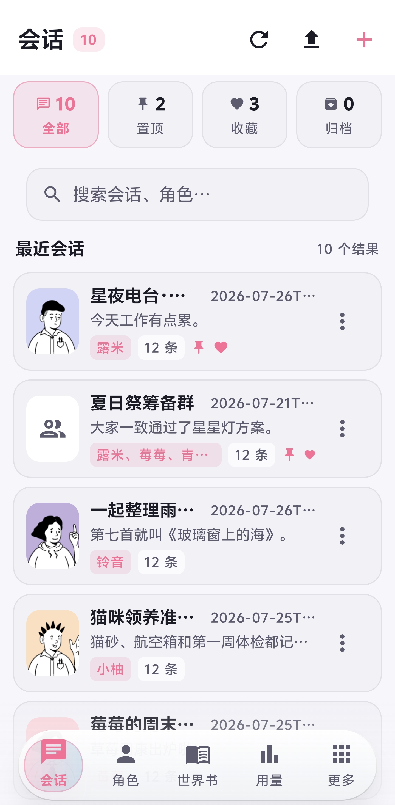<br /><sub>会话管理</sub></td>
    <td align="center">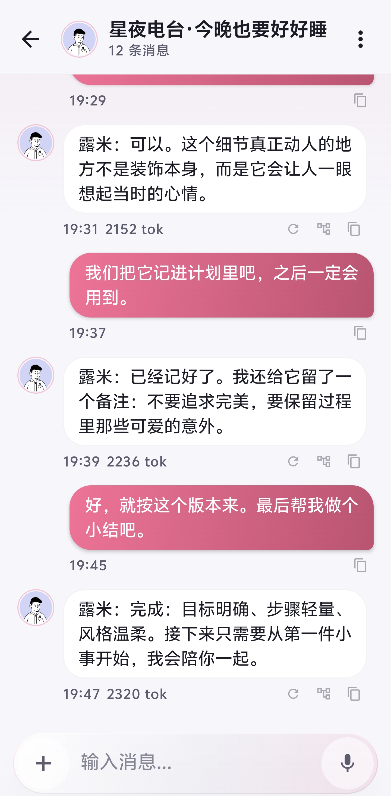<br /><sub>沉浸式聊天</sub></td>
    <td align="center">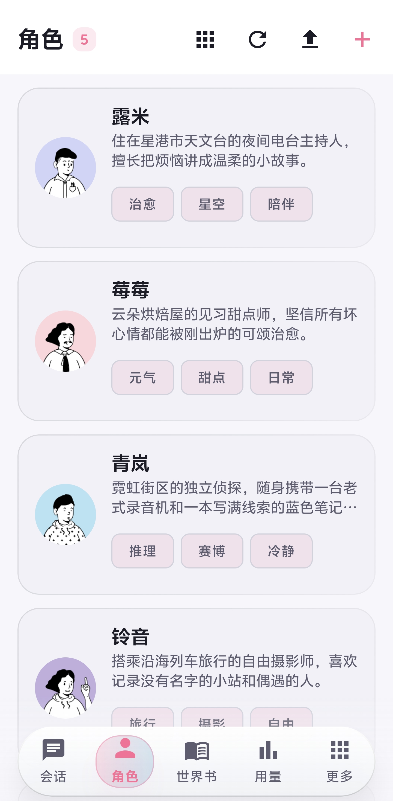<br /><sub>角色卡</sub></td>
  </tr>
  <tr>
    <td align="center">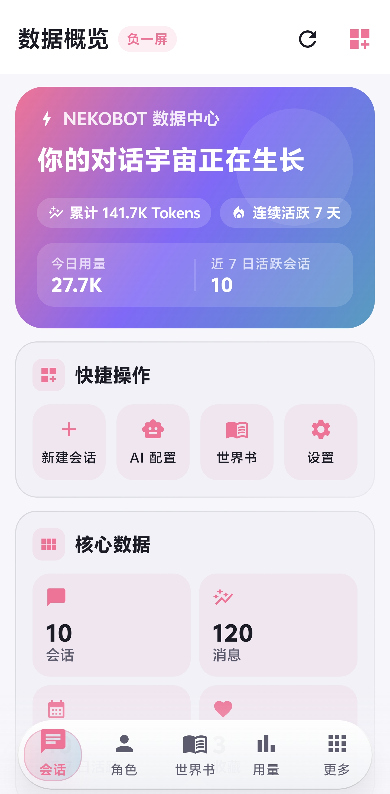<br /><sub>负一屏数据概览</sub></td>
    <td align="center">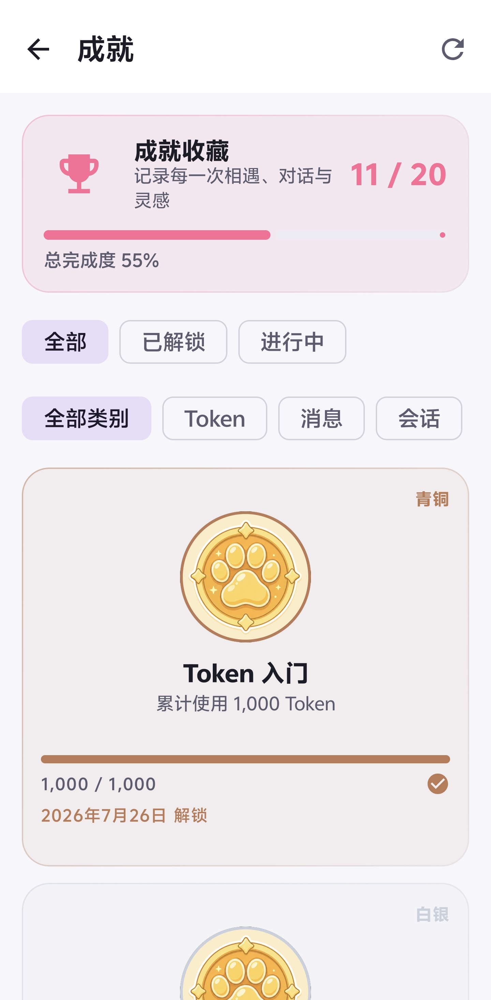<br /><sub>成就系统</sub></td>
    <td align="center">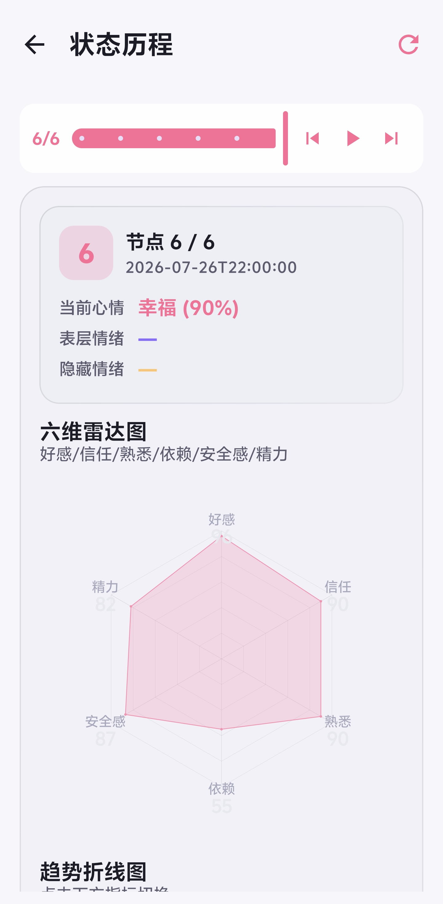<br /><sub>关系状态历程</sub></td>
  </tr>
</table>

<details>
<summary><b>查看更多界面</b></summary>

<br />

<table>
  <tr>
    <td align="center">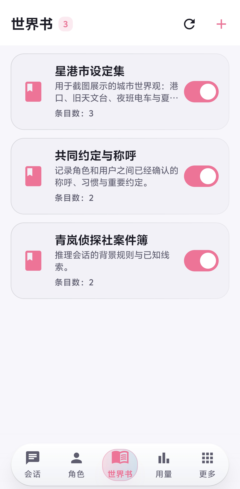<br /><sub>世界书</sub></td>
    <td align="center">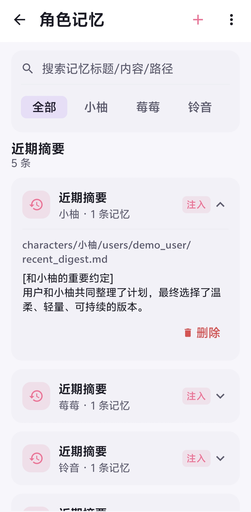<br /><sub>角色记忆</sub></td>
    <td align="center">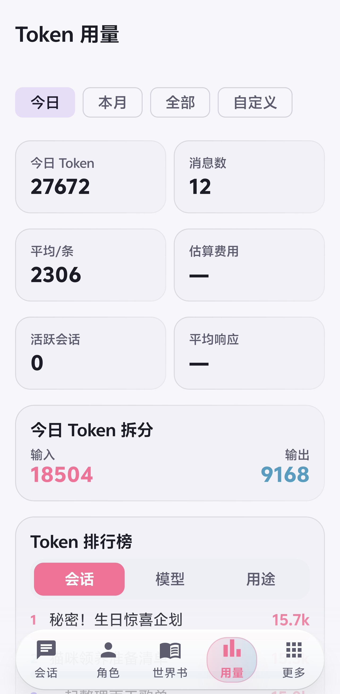<br /><sub>Token 用量</sub></td>
  </tr>
  <tr>
    <td align="center">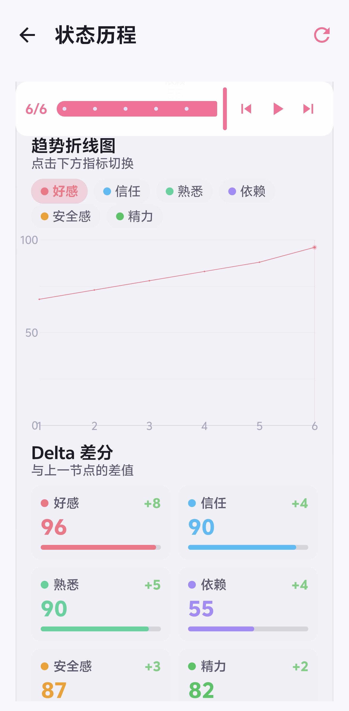<br /><sub>状态趋势与差分</sub></td>
    <td align="center">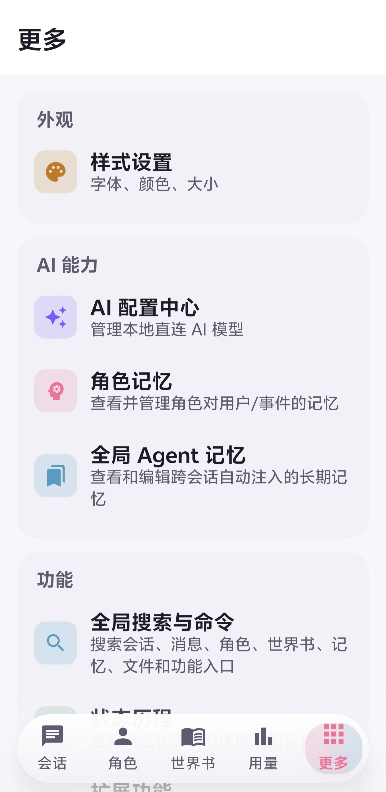<br /><sub>更多功能</sub></td>
    <td></td>
  </tr>
</table>

</details>

> 截图中的人物与对话均为虚构演示内容。可下载 [README 本地演示数据包](docs/assets/nekobot_readme_demo_data.zip)，在「更多 → 数据库管理」中导入并复现。

## ✨ 功能特性

### 🐾 核心体验

- **💬 沉浸式对话** — Socket.IO 流式回复、乐观更新、重新生成 / 停止生成、消息分叉与多选操作
- **🎭 角色卡系统** — 完整字段编辑（描述 / 人格 / 首条消息 / 场景 / 规则 / 立绘），支持导入 SillyTavern 酒馆卡（PNG 嵌入式、v2 / v3 JSON）
- **💞 角色运行时** — 六维关系系统、状态评估、记忆抽取、世界书注入、PromptStack 合成
- **🌍 世界书** — 条目 CRUD（关键词 / 常驻 / 选择 / 位置 / 优先级）、书信息编辑、多角色绑定
- **🌳 故事图** — Canvas 树状布局呈现剧情分支，支持分支选择、回滚与重生，本地持久化
- **📈 状态历程** — 角色状态随时间变化的可视化时间线
- **🧠 记忆管理** — 角色记忆的查看与编辑
- **🤖 Agent 模式** — 多轮工具调用、可展开的实时进度卡片、原生浏览器、Linux 沙箱、会话终端与文件处理

### 🛠 个性化与工具

- **🤖 AI 配置中心** — 模型 / 温度 / max_tokens / top_p / 惩罚参数编辑、故障转移队列、一键测试连接
- **🧩 AI 模型管理** — 模型 CRUD、应用 / 启用 / 克隆、拉取可用模型列表、本地 AI 模型配置
- **📊 Token 用量** — 今日 / 本月 / 累计 / 费用统计、日期分组、会话 / 模型 / 用户排行、性能指标
- **🎤 语音与 TTS** — 录音转写为文字（服务器模式）、TTS 试听
- **📝 Markdown 渲染** — 内独白折叠、全角括号斜体、带语言标签与复制按钮的代码块、横滑表格
- **🗂 工作区** — 文件引用、预览与下载
- **🧩 插件系统** — 本地模式支持内置模块与 ZIP JavaScript 插件，命令、会话读取、隔离存储、通知和受控 HTTPS 请求均由显式权限管理；开发方式见[插件开发指南](docs/plugin-development.md)
- **🧰 12+ 扩展功能** — API Keys、频道、钩子、知识库、登录令牌、MCP 服务器、消息过滤、技能、任务中心、工具、工作流
- **⚙️ 系统设置** — 服务器地址切换、设置 JSON 编辑器、功能开关、数据维护、配置迁移、WebDAV 备份

### 🎨 设计

- **🌙 深色玻璃拟态** — 液态玻璃底部导航栏、玻璃卡片、自定义弹窗与状态芯片
- **🌈 自定义主题色** — 配合流式占位骨架动画，等待也优雅

## 🤖 Agent 模式

Agent 模式运行在本地模式中，让支持 Function Calling / Tool Use 的模型不只生成文字，还能在会话内浏览网页、操作文件、执行 Linux 命令并持续完成多步骤任务。

| 能力               | 说明                                                     |
| ---------------- | ------------------------------------------------------ |
| **多轮工具执行**       | 模型可连续规划和调用工具；进度卡片实时显示思考、参数、结果与错误，用户展开状态不会因新工具事件而重置     |
| **原生浏览器**        | 支持多标签页、点击、输入、滚动、前进/后退、JavaScript、视口与 User-Agent 切换     |
| **网页读取**         | 可读取正文、动态 DOM 源码、交互骨架和结构化 URL，并支持 Cookie 登录态下的网页请求与文件下载 |
| **浏览器预览**        | 聊天页可实时查看当前网页，支持全屏放大；AI 可截取当前页或长页面并交给视觉模型理解图片、图表和复杂布局   |
| **Linux 沙箱**     | 内置 Alpine Linux + PRoot，支持安装软件包、运行脚本、启动后台进程和复用命令行环境    |
| **会话终端**         | Agent 会话右上角菜单可打开全屏命令行，直接操作该会话的 `/workspace`            |
| **文件与图片工具**      | 支持读取、写入、精确编辑、列出、解析和发送工作区文件，也可调用视觉模型理解本地图片              |
| **Skills 与 MCP** | Agent 可读取已启用的本地 Skills，并调用已连接 MCP 服务提供的工具              |
| **运行保护**         | 高风险命令需要确认；工具参数会在执行前修复和校验，连续重复且无进展的调用会自动停止              |
| **后台执行**         | Agent 工作期间启用前台服务和常驻通知，降低切到后台后任务被 Android 提前终止的概率       |

### 沙箱数据与会话隔离

- 所有 Agent 会话共享同一套可写 Linux rootfs，因此通过 `apk add` 安装的软件和 `/root` 数据可以复用。
- 每个 Agent 会话拥有独立的 `/workspace`，文件不会自动混入其他会话。
- 正常覆盖安装同签名的新 APK 会保留 rootfs、已安装软件和工作区；卸载应用或清除应用数据仍会删除这些内容。
- 后台进程可以跨同一会话的多次命令继续运行，但强制停止应用、重启手机或系统回收进程后需要重新启动。

> Linux 沙箱目前仅支持 `arm64-v8a` 设备。Agent 使用的模型应支持工具调用；网页截图和本地图片理解还需要配置可用的视觉模型。

## 🔄 双模式架构

|           | 🌐 服务器模式                | 📱 本地模式                            |
| --------- | ----------------------- | ---------------------------------- |
| **后端**    | 连接 NekoBot Web 后端       | 无需后端，直连 OpenAI 兼容 API              |
| **通信**    | REST + Socket.IO 实时流式推送 | 本地直接请求 AI API                      |
| **数据存储**  | 服务器 + 本地缓存              | Room 数据库 + 会话工作区 + 可写 Linux rootfs |
| **Agent** | 由服务器能力决定                | 内置浏览器、Linux 沙箱、终端、Skills 与 MCP     |
| **适用场景**  | 完整功能生态、多端同步             | 隐私优先、本地数据、自有 API Key、移动端 Agent     |

## 📦 下载安装

<div align="center">

[](https://github.com/asukaneko/Nekobot-Android/releases/latest)

**要求 Android 8.0（API 26）及以上** · 应用内支持检查更新与下载安装

</div>

## 🚀 快速上手

**🌐 服务器模式**

1. 启动应用，在登录页输入服务器地址、用户名、密码
2. 登录成功进入会话页，底部导航切换功能
3. 聊天页发送消息后，AI 回复通过 Socket.IO 实时流式推送
4. 设置页可修改服务器地址（写入后自动重建网络与 Socket 客户端）

**📱 本地模式**

1. 登录页切换至本地模式
2. 在「本地 AI 模型」中配置 OpenAI 兼容 API 地址与密钥
3. 数据全部存储于本地，支持会话 / 角色 / 世界书 / 记忆等完整功能
4. 设置页可查看本地运行日志

**🤖 Agent 模式**

1. 按本地模式完成模型配置，并确认聊天模型支持工具调用
2. 在会话页新建会话时选择「Agent」
3. 直接描述目标；AI 会按需使用浏览器、工作区、Linux、Skills 或 MCP 工具
4. 点击进度卡片可查看每一步参数与结果；浏览器运行时可打开实时预览
5. 点击聊天页右上角菜单中的「命令行」可直接进入当前会话沙箱

> 对需要写入或修改系统状态的命令，应用会弹出授权确认。输入 `/yolo` 可为当前会话跳过普通命令确认，但高风险黑名单仍然生效，请仅在可信任务中使用。

## 🛠 技术栈

| 类别        | 选型                                         |
| --------- | ------------------------------------------ |
| 语言        | Kotlin 2.0.21                              |
| UI        | Jetpack Compose（BOM 2024.09.02）+ Material3 |
| 架构        | MVVM（BaseViewModel + StateFlow）            |
| 异步        | Kotlin Coroutines 1.9.0                    |
| 网络        | Retrofit 2.11 + OkHttp 4.12 + Gson         |
| 实时通信      | socket.io-client-java 2.1.0                |
| 数据库       | Room 2.6.1（KSP 注解处理）                       |
| 图片加载      | Coil 2.7.0（crossfade + 256MB 磁盘缓存）         |
| 导航        | Navigation Compose 2.8.2                   |
| Agent 运行时 | Android WebView + Alpine Linux + PRoot     |
| 构建        | Gradle 8.11.1 + AGP 8.9.1 + KSP            |

## 🔧 从源码构建

<details>
<summary><b>展开构建指南</b>（JDK 17+ / Android SDK 35）</summary>

<br>

**1. 配置 SDK 路径**

在项目根目录创建 `local.properties`：

```properties
sdk.dir=/path/to/Android/Sdk
```

**2. 编译**

```bash
# Windows
gradlew.bat assembleDebug

# Linux / macOS
./gradlew assembleDebug
```

产物：`app/build/outputs/apk/debug/app-debug.apk`

**3. Release 构建**

```bash
gradlew.bat assembleRelease
```

产物：`app/build/outputs/apk/release/app-release.apk`

> Release 构建复用 debug 签名配置，生成的 APK 可直接安装。

**4. 安装到设备**

```bash
adb install -r app/build/outputs/apk/debug/app-debug.apk
```

</details>

<details>
<summary><b>项目结构</b></summary>

<br>

```
app/src/main/kotlin/com/nekobot/app/
├── MainActivity.kt                  # Activity 入口
├── NekobotApp.kt                    # Application + ServiceContainer + Coil ImageLoader
├── data/
│   ├── local/
│   │   ├── ai/                       # Agent Pipeline、工具循环、浏览器与 Linux 沙箱
│   │   ├── LocalLogger.kt           # 本地日志（SharedPreferences 持久化，上限 2000 条）
│   │   ├── LocalRepository.kt       # 本地模式数据仓库（Room）
│   │   └── PrefsManager.kt          # SharedPreferences 封装
│   ├── model/Models.kt              # 数据模型
│   ├── remote/
│   │   ├── ApiService.kt            # Retrofit 接口
│   │   ├── AuthInterceptor.kt       # Token 注入
│   │   ├── NetworkClient.kt         # Retrofit 工厂
│   │   └── SocketManager.kt         # Socket.IO 客户端
│   └── repository/
│       ├── NekobotRepository.kt     # 服务器模式仓库
│       └── UnifiedRepository.kt     # 模式统一入口（按 appMode 分发）
├── service/
│   └── AgentForegroundService.kt    # Agent 后台执行前台服务
└── ui/
    ├── BaseViewModel.kt             # 统一 loading/error 处理
    ├── components/
    │   ├── CommonComponents.kt      # GlassCard、NekoDialog、ToggleChip 等
    │   └── MarkdownText.kt          # Markdown 渲染组件
    ├── navigation/
    │   ├── NavGraph.kt              # 路由图
    │   ├── Routes.kt                # 路由定义
    │   └── LiquidGlassBottomBar.kt  # 液态玻璃底部导航栏
    ├── screens/
    │   ├── login/                   # 登录
    │   ├── sessions/                # 会话列表 + 会话详情
    │   ├── chat/                    # 对话 + 工作区 + 多媒体内容
    │   ├── characters/              # 角色卡列表 + 详情
    │   ├── worldbook/               # 世界书列表 + 详情
    │   ├── memory/                  # 角色记忆
    │   ├── plot/                    # 故事图
    │   ├── statehistory/            # 状态历程
    │   ├── tokens/                  # Token 用量
    │   ├── aiconfig/                # AI 配置中心 + 模型 + 故障转移 + 本地模型
    │   ├── extensions/              # 扩展功能（12 个高级配置页面）
    │   ├── settings/                # 系统设置 + 功能开关 + 数据维护 + 配置迁移 + WebDAV + 样式
    │   └── more/                    # 更多
    └── theme/                       # 颜色 / 排版 / 主题
```

</details>

## 🔐 权限说明

| 权限                                                    | 用途                    |
| ----------------------------------------------------- | --------------------- |
| `INTERNET`                                            | 网络通信、Agent 浏览器与沙箱网络访问 |
| `ACCESS_NETWORK_STATE`                                | 检测网络状态                |
| `RECORD_AUDIO`                                        | 语音输入（服务器模式）           |
| `POST_NOTIFICATIONS`                                  | 会话通知与 Agent 后台运行状态    |
| `FOREGROUND_SERVICE` / `FOREGROUND_SERVICE_DATA_SYNC` | Agent 长任务在前台服务中继续执行   |
| `WAKE_LOCK`                                           | Agent 执行期间避免 CPU 过早休眠 |

## 🐞 调试

实时通信日志标签为 `NekoSocket`：

```bash
adb logcat -s NekoSocket:V
```

## 🤝 参与贡献

欢迎提交 Issue 与 Pull Request！版本变更记录见 [changelog.md](changelog.md)，插件开发请阅读[插件开发指南](docs/plugin-development.md)。

---

<div align="center">

基于 [GPL v3](LICENSE) 协议开源 · 衍生作品须同样以 GPL v3 发布

**[官方网站](https://asukaneko.github.io/Nekobot-Android/)** · **[问题反馈](https://github.com/asukaneko/Nekobot-Android/issues)** · **[最新版本](https://github.com/asukaneko/Nekobot-Android/releases/latest)**

🐾 Made with 💗 by [Asukaneko](https://github.com/asukaneko)

</div>
