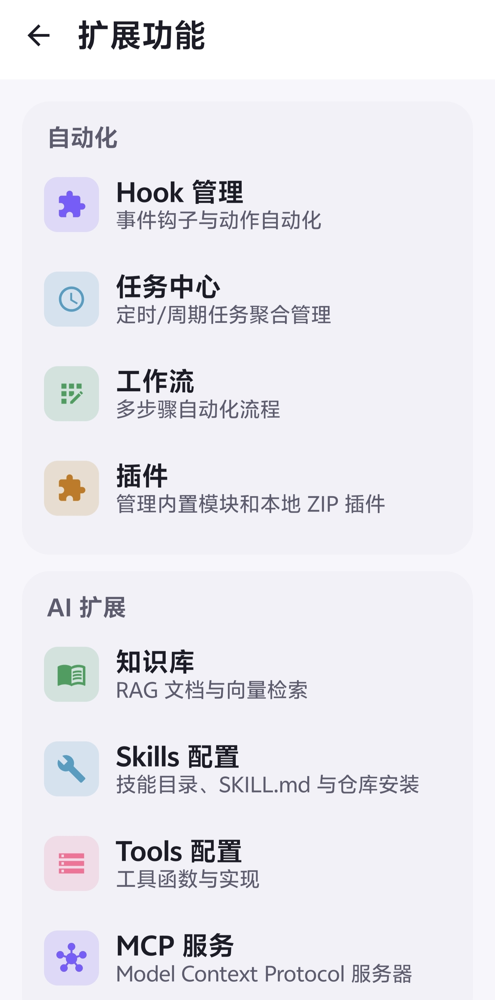

<div align="center">


[中文](./README.md) | **English**

# NekoBot Android

**Start a gentle conversation with your AI companion**

Native Android client · Server / Local dual mode · Dark glassmorphism UI

[](https://github.com/asukaneko/Nekobot-Android/releases/latest)
[](https://github.com/asukaneko/Nekobot-Android/releases)
[](https://developer.android.com)
[](https://kotlinlang.org)
[](LICENSE)
[](https://github.com/asukaneko/Nekobot-Android/stargazers)

[Screenshots](#-screenshots) · [Features](#-features) · [Agent Mode](#-agent-mode) · [Install](#-install) · [Dual Mode](#-dual-mode-architecture) · [Build from Source](#-build-from-source) · [Changelog](changelog.md) · [Official Site](https://asukaneko.github.io/Nekobot-Android/)

</div>

---

## 📱 Screenshots

<table>
  <tr>
    <td align="center"><br /><sub>Session Management</sub></td>
    <td align="center"><br /><sub>Immersive Chat</sub></td>
    <td align="center"><br /><sub>Character Cards</sub></td>
  </tr>
  <tr>
    <td align="center"><br /><sub>Dashboard Widget</sub></td>
    <td align="center"><br /><sub>Achievement System</sub></td>
    <td align="center"><br /><sub>Relationship Timeline</sub></td>
  </tr>
</table>

<details>
<summary><b>View more screens</b></summary>

<br />

<table>
  <tr>
    <td align="center"><br /><sub>World Books</sub></td>
    <td align="center"><br /><sub>Character Memory</sub></td>
    <td align="center"><br /><sub>Token Usage</sub></td>
  </tr>
  <tr>
    <td align="center"><br /><sub>Trends & Diff</sub></td>
    <td align="center"><br /><sub>More Features</sub></td>
    <td align="center"><br /><sub>Extended Features</sub></td>
  </tr>
</table>

</details>

> All characters and conversations shown in the screenshots are fictional demo content. You can download the [README demo data pack](docs/assets/nekobot_readme_demo_data.zip) and import it under "More → Database Manager" to reproduce them.

## ✨ Features

### 🐾 Core Experience

- **💬 Immersive Chat** — Socket.IO streaming replies, optimistic updates, regenerate / stop, message forking and multi-select
- **🎭 Character Cards** — Full field editing (description / personality / greeting / scenario / rules / avatar) with SillyTavern import support (embedded PNG, v2 / v3 JSON)
- **💞 Character Runtime** — Six-dimension relationship system, state evaluation, memory extraction, world book injection, PromptStack composition
- **🌍 World Books** — Entry CRUD (keywords / always-on / selective / position / priority), book metadata editing, multi-character binding
- **🌳 Story Graph** — Canvas tree layout for plot branches; supports branch selection, rollback and regeneration with local persistence
- **📈 State History** — Visual timeline of how a character's state evolves over time
- **🧠 Memory Management** — View and edit character memories
- **🤖 Agent Mode** — Multi-turn tool calling, expandable real-time progress cards, native browser, Linux sandbox, session terminal and file handling

### 🛠 Personalization & Tools

- **🤖 AI Config Center** — Edit model / temperature / max_tokens / top_p / penalty parameters, failure transfer queue, one-click connection test
- **🧩 AI Model Management** — Model CRUD, apply / enable / clone, fetch available model list, local AI model config
- **📊 Token Usage** — Today / this month / all-time / cost statistics, daily grouping, session / model / user ranking, performance metrics
- **🎤 Voice & TTS** — Record and transcribe to text (server mode), TTS preview
- **📝 Markdown Rendering** — Inner monologue folding, full-width bracket italics, code blocks with language labels and copy button, horizontally scrollable tables
- **🗂 Workspace** — File reference, preview and download
- **🧰 12+ Extensions** — API Keys, channels, hooks, knowledge base, login tokens, MCP servers, message filters, skills, task center, tools, workflows
- **⚙️ System Settings** — Server URL switching, settings JSON editor, feature switches, data maintenance, config migration, WebDAV backup

### 🎨 Design

- **🌙 Dark Glassmorphism** — Liquid-glass bottom navigation bar, glass cards, custom dialogs and status chips
- **🌈 Custom Theme Color** — Paired with streaming placeholder skeleton animation, so even waiting feels elegant

## 🤖 Agent Mode

Agent mode runs in local mode, allowing models that support Function Calling / Tool Use not only to generate text, but also to browse the web, manipulate files, execute Linux commands and continuously complete multi-step tasks within a session.

| Capability                    | Description                                                                                                                                                                                                  |
| ----------------------------- | ------------------------------------------------------------------------------------------------------------------------------------------------------------------------------------------------------------ |
| **Multi-turn Tool Execution** | Models can plan and call tools continuously; the progress card displays reasoning, parameters, results and errors in real time, and the expanded state is preserved across new tool events.                  |
| **Native Browser**            | Multi-tab support, click, input, scroll, forward/back, JavaScript, viewport and User-Agent switching.                                                                                                        |
| **Web Reading**               | Read body content, dynamic DOM source, interaction skeletons and structured URLs; supports Cookie-authenticated requests and file downloads.                                                                 |
| **Browser Preview**           | View the current page in real time on the chat screen with full-screen zoom; AI can capture the current page or long pages and send them to a vision model to understand images, charts and complex layouts. |
| **Linux Sandbox**             | Built-in Alpine Linux + PRoot, supports package installation, running scripts, launching background processes and reusing the command-line environment.                                                      |
| **Session Terminal**          | A full-screen command line can be opened from the top-right menu of an Agent session, directly operating the session's `/workspace`.                                                                         |
| **Files & Images**            | Read, write, edit precisely, list, parse and send workspace files; can call vision models to understand local images.                                                                                        |
| **Skills & MCP**              | Agent can read enabled local Skills and call tools provided by connected MCP servers.                                                                                                                        |
| **Execution Guard**           | High-risk commands require confirmation; tool parameters are fixed and validated before execution; repeated, no-progress calls are auto-stopped.                                                             |
| **Background Execution**      | Foreground service and persistent notification are enabled during Agent work, reducing the chance of Android killing tasks when going to the background.                                                     |

### Sandbox Data & Session Isolation

- All Agent sessions share a single writable Linux rootfs, so software installed via `apk add` and data in `/root` can be reused.
- Each Agent session has its own independent `/workspace`; files will not mix into other sessions.
- A normal over-install of a same-signature new APK preserves the rootfs, installed software and workspace; uninstalling the app or clearing app data still deletes these.
- Background processes can continue running across multiple commands in the same session, but force-stopping the app, rebooting the phone or the system reclaiming the process requires a restart.

> The Linux sandbox currently only supports `arm64-v8a` devices. The model used by Agent should support tool calling; web screenshots and local image understanding additionally require a configured vision model.

## 🔄 Dual Mode Architecture

|                   | 🌐 Server Mode                            | 📱 Local Mode                                                 |
| ----------------- | ----------------------------------------- | ------------------------------------------------------------- |
| **Backend**       | Connect to the NekoBot Web backend        | No backend, direct connection to OpenAI-compatible API        |
| **Communication** | REST + Socket.IO real-time streaming      | Local direct AI API requests                                  |
| **Data Storage**  | Server + local cache                      | Room database + session workspace + writable Linux rootfs     |
| **Agent**         | Depends on server capabilities            | Built-in browser, Linux sandbox, terminal, Skills and MCP     |
| **Use Cases**     | Full feature ecosystem, multi-device sync | Privacy-first, local data, your own API keys, on-device Agent |

## 📦 Install

<div align="center">

[](https://github.com/asukaneko/Nekobot-Android/releases/latest)

**Requires Android 8.0 (API 26) or above** · The app supports in-app update check and install

</div>

## 🚀 Quick Start

**🌐 Server Mode**

1. Launch the app, enter the server URL, username and password on the login page
2. After successful login, the sessions page opens with the bottom navigation switching features
3. Send a message on the chat page and the AI reply streams in real time via Socket.IO
4. The server URL can be changed in the settings page (the network and Socket client are rebuilt automatically after writing)

**📱 Local Mode**

1. Switch to local mode on the login page
2. Configure the OpenAI-compatible API URL and key under "Local AI Model"
3. All data is stored locally, supporting full features like sessions / characters / world books / memory
4. View local runtime logs on the settings page

**🤖 Agent Mode**

1. Complete the model configuration as in local mode, and confirm the chat model supports tool calling
2. Choose "Agent" when creating a new session on the sessions page
3. Describe the goal directly; the AI will use the browser, workspace, Linux, Skills or MCP tools as needed
4. Click the progress card to view the parameters and result of each step; a real-time preview opens when the browser is running
5. Click "Command Line" in the top-right menu of the chat page to enter the current session sandbox

> For commands that need to write or modify system state, the app will pop up an authorization confirmation. Entering `/yolo` skips normal command confirmation for the current session, but the high-risk blacklist still applies — use it only on trusted tasks.

## 🛠 Tech Stack

| Category      | Stack                                        |
| ------------- | -------------------------------------------- |
| Language      | Kotlin 2.0.21                                |
| UI            | Jetpack Compose (BOM 2024.09.02) + Material3 |
| Architecture  | MVVM (BaseViewModel + StateFlow)             |
| Async         | Kotlin Coroutines 1.9.0                      |
| Network       | Retrofit 2.11 + OkHttp 4.12 + Gson           |
| Real-time     | socket.io-client-java 2.1.0                  |
| Database      | Room 2.6.1 (KSP annotation processing)       |
| Image Loading | Coil 2.7.0 (crossfade + 256MB disk cache)    |
| Navigation    | Navigation Compose 2.8.2                     |
| Agent Runtime | Android WebView + Alpine Linux + PRoot       |
| Build         | Gradle 8.11.1 + AGP 8.9.1 + KSP              |

## 🔧 Build from Source

<details>
<summary><b>Expand build guide</b> (JDK 17+ / Android SDK 35)</summary>

<br>

**1. Configure the SDK path**

Create `local.properties` in the project root:

```properties
sdk.dir=/path/to/Android/Sdk
```

**2. Compile**

```bash
# Windows
gradlew.bat assembleDebug

# Linux / macOS
./gradlew assembleDebug
```

Output: `app/build/outputs/apk/debug/app-debug.apk`

**3. Release build**

```bash
gradlew.bat assembleRelease
```

Output: `app/build/outputs/apk/release/app-release.apk`

> The release build reuses the debug signing config; the resulting APK is directly installable.

**4. Install to device**

```bash
adb install -r app/build/outputs/apk/debug/app-debug.apk
```

</details>

<details>
<summary><b>Project Structure</b></summary>

<br>

```
app/src/main/kotlin/com/nekobot/app/
├── MainActivity.kt                  # Activity entry
├── NekobotApp.kt                    # Application + ServiceContainer + Coil ImageLoader
├── data/
│   ├── local/
│   │   ├── ai/                       # Agent Pipeline, tool loop, browser & Linux sandbox
│   │   ├── LocalLogger.kt           # Local logger (SharedPreferences persistent, max 2000 entries)
│   │   ├── LocalRepository.kt       # Local mode data repository (Room)
│   │   └── PrefsManager.kt          # SharedPreferences wrapper
│   ├── model/Models.kt              # Data models
│   ├── remote/
│   │   ├── ApiService.kt            # Retrofit interface
│   │   ├── AuthInterceptor.kt       # Token injection
│   │   ├── NetworkClient.kt         # Retrofit factory
│   │   └── SocketManager.kt         # Socket.IO client
│   └── repository/
│       ├── NekobotRepository.kt     # Server mode repository
│       └── UnifiedRepository.kt     # Unified mode entry (dispatched by appMode)
├── service/
│   └── AgentForegroundService.kt    # Foreground service for Agent background execution
└── ui/
    ├── BaseViewModel.kt             # Unified loading/error handling
    ├── components/
    │   ├── CommonComponents.kt      # GlassCard, NekoDialog, ToggleChip, etc.
    │   └── MarkdownText.kt          # Markdown rendering component
    ├── navigation/
    │   ├── NavGraph.kt              # Route graph
    │   ├── Routes.kt                # Route definitions
    │   └── LiquidGlassBottomBar.kt  # Liquid glass bottom navigation bar
    ├── screens/
    │   ├── login/                   # Login
    │   ├── sessions/                # Session list + session detail
    │   ├── chat/                    # Chat + workspace + multimedia content
    │   ├── characters/              # Character card list + detail
    │   ├── worldbook/               # World book list + detail
    │   ├── memory/                  # Character memory
    │   ├── plot/                    # Story graph
    │   ├── statehistory/            # State history
    │   ├── tokens/                  # Token usage
    │   ├── aiconfig/                # AI config center + models + failover + local models
    │   ├── extensions/              # Extensions (12 advanced config pages)
    │   ├── settings/                # System settings + feature switches + data maintenance + config migration + WebDAV + styles
    │   └── more/                    # More
    └── theme/                       # Colors / typography / theme
```

</details>

## 🔐 Permissions

| Permission                                            | Purpose                                                         |
| ----------------------------------------------------- | --------------------------------------------------------------- |
| `INTERNET`                                            | Network communication, Agent browser and sandbox network access |
| `ACCESS_NETWORK_STATE`                                | Detect network status                                           |
| `RECORD_AUDIO`                                        | Voice input (server mode)                                       |
| `POST_NOTIFICATIONS`                                  | Session notifications and Agent background status               |
| `FOREGROUND_SERVICE` / `FOREGROUND_SERVICE_DATA_SYNC` | Agent long-running tasks continue in the foreground service     |
| `WAKE_LOCK`                                           | Avoid early CPU sleep during Agent execution                    |

## 🐞 Debugging

The real-time communication log tag is `NekoSocket`:

```bash
adb logcat -s NekoSocket:V
```

## 🤝 Contributing

Issues and Pull Requests are welcome! See [changelog.md](changelog.md) for version history.

---

<div align="center">

Open source under the [GPL v3](LICENSE) license · Derivative works must also be released under GPL v3

**[Official Site](https://asukaneko.github.io/Nekobot-Android/)** · **[Issue Tracker](https://github.com/asukaneko/Nekobot-Android/issues)** · **[Latest Release](https://github.com/asukaneko/Nekobot-Android/releases/latest)**

🐾 Made with 💗 by [Asukaneko](https://github.com/asukaneko)

</div>
